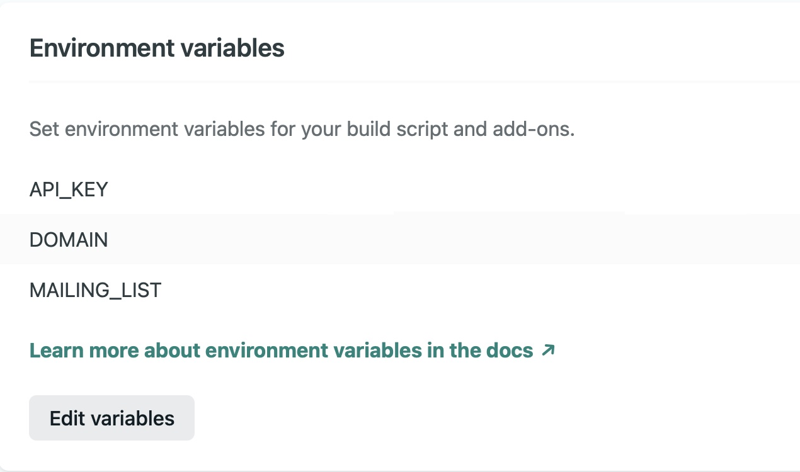
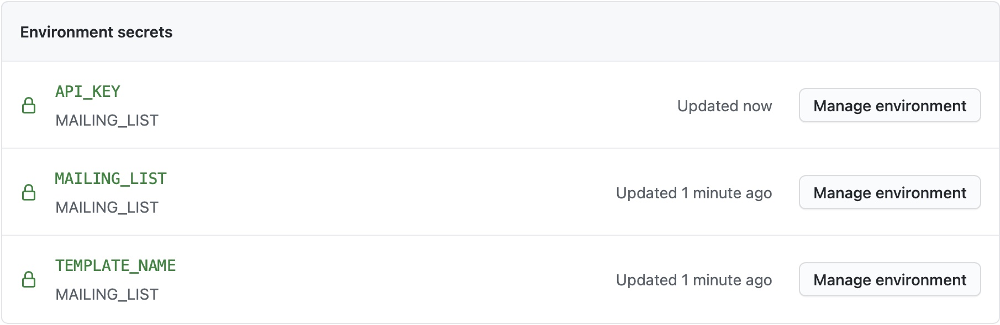

# Serverless Newsletter Service using Netlify

## Configure Environment Variables in Netlify

If you directly deploy this app from above link, it will throw error. So you need to provide environment variables in Netlify App and re-build it. Go to **Site settings > Build & deploy > Environment** and add the following Environment variables:

## Configure Environment Variables in GitHub Secrets

To make the script for CronJob to work, you need to add three variables in the Secrets settings in your repository. Go to **Settings > Secrets** and add the following variables:

## More Information

Feel free to read [this article](https://ruddra.com/serverless-and-actions/) where I explained the steps to create this application :sparkle:.

## License

MIT :smile:.
